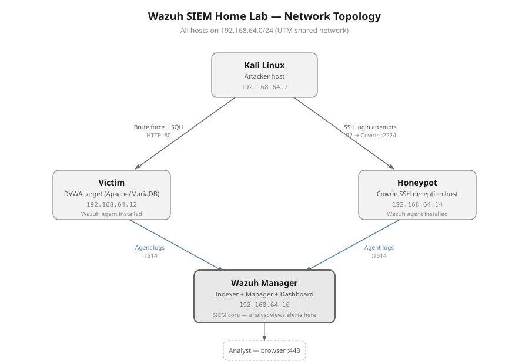
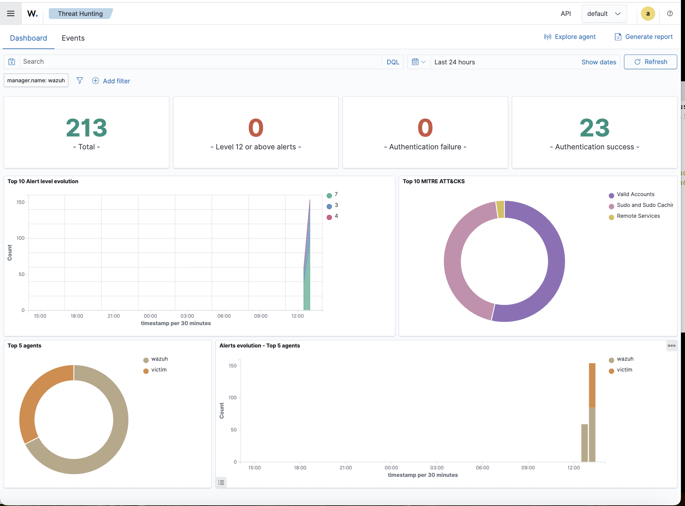
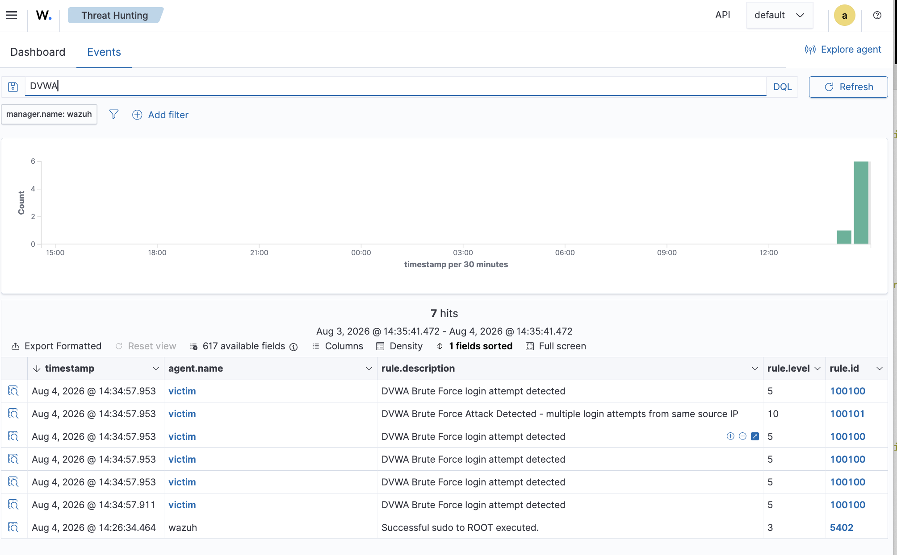
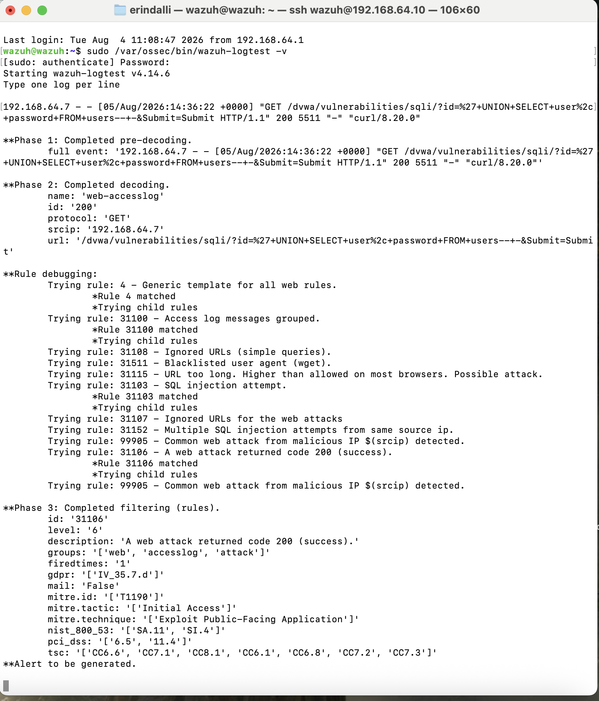
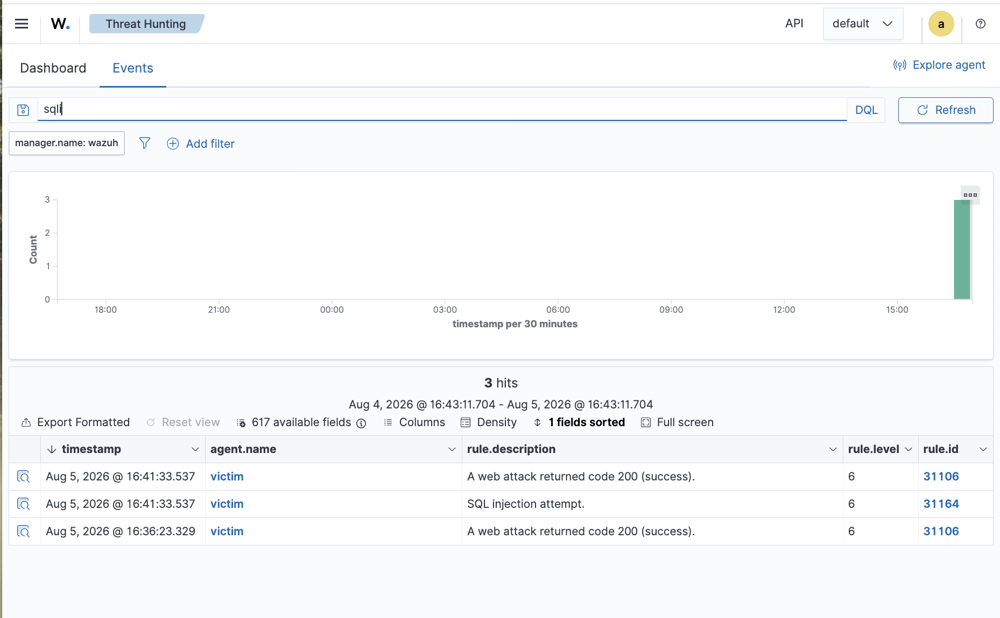
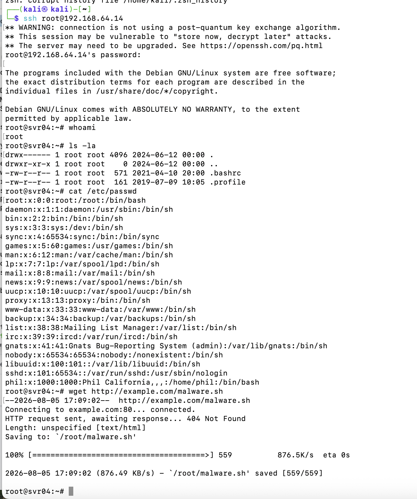
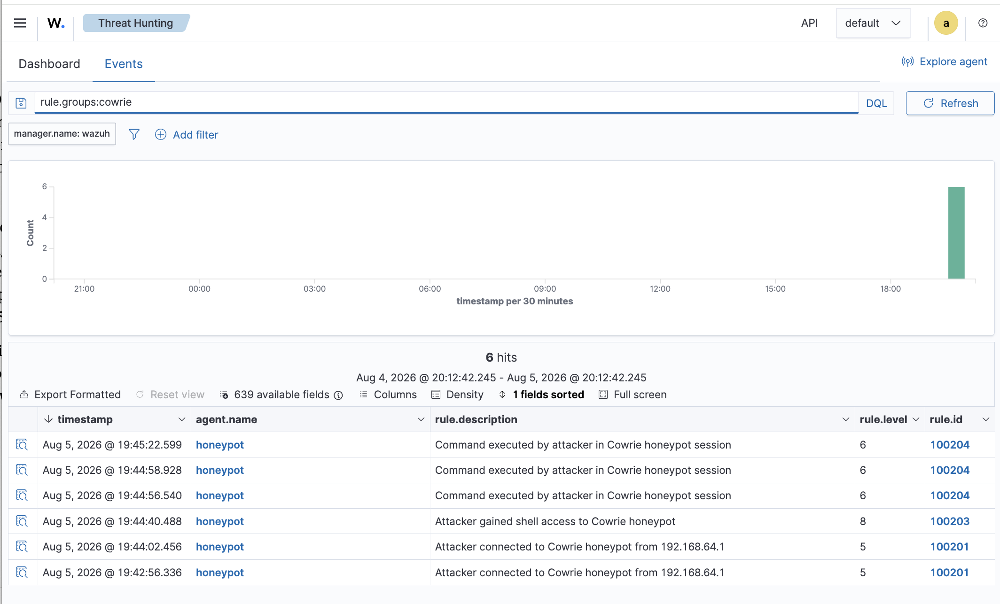

# Wazuh SIEM Home Lab

I built this SIEM from scratch across four virtual machines: a self-hosted Wazuh install, a deliberately vulnerable web app to attack, and a Cowrie SSH honeypot to watch attacker behaviour directly. Along the way I wrote custom detection rules, simulated a couple of real attack techniques, and worked through a fair few infrastructure problems that came up.

The full write-up (architecture, every issue I hit and how I diagnosed it, all the detection rules, and screenshots) is in [`docs/Wazuh_SIEM_Lab_Report.pdf`](docs/Wazuh_SIEM_Lab_Report.pdf).

## Architecture



| VM | Role | IP |
|---|---|---|
| Wazuh Manager | Indexer + Manager + Dashboard (SIEM core) | 192.168.64.10 |
| Kali Linux | Attacker host | 192.168.64.7 |
| Victim | Target running DVWA (Apache/MariaDB) | 192.168.64.12 |
| Honeypot | Cowrie SSH deception host | 192.168.64.14 |

## Attacks simulated

| Attack | Target | Detection | MITRE ATT&CK |
|---|---|---|---|
| Brute-force login | DVWA custom login form | Custom rule (no built-in coverage existed) | T1110 (Brute Force) |
| SQL injection (UNION-based) | DVWA SQLi module | Built-in Wazuh ruleset, zero config | T1190 (Exploit Public-Facing Application) |
| SSH login + post-exploitation commands | Cowrie honeypot | Custom rule set built for Cowrie's JSON log | T1078, T1059, T1595 |
| Malware download capture | Cowrie honeypot | Custom rule, file hashed automatically by Cowrie | T1105 (Ingress Tool Transfer) |

## Problems I ran into

**Credentials scattered across every service.** The indexer, manager, dashboard, and Filebeat each keep their own separate login store. Whenever something broke, my first instinct was to go by whatever the browser was telling me, but that was usually misleading. The only reliable way to find the actual failing layer was to test each service directly through its own API.

**A log collection failure with no error message.** The Wazuh agent reported "Analyzing file" for Apache's access log and looked completely healthy, but nothing was reaching the dashboard. It turned out to be a file permission issue that never showed up anywhere in the agent's own log. I only found it by testing the full pipeline end to end instead of trusting the collector's status message.

**A detection rule that matched but never fired.** I'd written the rule logic correctly, but it had no parent (`<if_sid>`), so Wazuh's rule engine never evaluated it at all, since only the child rules under whichever root rule claims an event actually get checked. Tracked this down with `wazuh-logtest -v`.

**Cloning a VM cloned more than I expected.** Cloning the Victim VM to build the honeypot also duplicated its MAC address and its Wazuh agent identity, which caused an IP collision and made Wazuh treat the new machine as the same host as the original. Had to regenerate both before it worked as its own separate agent.

**Moving SSH off port 22 needed more than an sshd_config edit.** I needed the port free for Cowrie, but Ubuntu's socket activation controls the actual port binding separately from sshd's own config file, so editing sshd_config alone did nothing. Had to add a `ssh.socket` override as well.

**Building detection from scratch for a log source Wazuh had never seen.** Cowrie's logs are JSON and there was no existing rule coverage for them. I pulled the real field names straight out of the raw log lines rather than guessing, built a base rule with child rules attached underneath it, and validated the whole tree with `wazuh-logtest` before pushing it to the live manager.

## Skills demonstrated

- SIEM deployment and administration (Wazuh indexer, manager, dashboard, agents)
- Linux system administration (systemd, LVM/disk management, service hardening, user/permission management)
- Custom detection rule authoring and validation (Wazuh rule XML, `wazuh-logtest`)
- MITRE ATT&CK mapping
- Web application attack simulation (brute force, SQL injection) with Hydra/curl and manual exploitation
- Honeypot deployment and attacker behavior capture (Cowrie)
- Root-cause troubleshooting across a multi-service, multi-VM stack

## Screenshots

| | |
|---|---|
|  Wazuh Threat Hunting dashboard |  Custom rule catching DVWA brute force |
|  `wazuh-logtest` validating built-in SQLi rule |  SQL injection alerts in the dashboard |
|  Attacker session inside the Cowrie fake shell |  Full connect → login → command alert chain |

## Repo contents

```
docs/         Full report (PDF + Word), including every issue hit and fixed
rules/        Custom Wazuh detection rules (local_rules.xml)
diagrams/     Network topology diagram
screenshots/  Highlight screenshots (full set is in the report)
```

## Notes

Everything here runs on local virtual machines (UTM on macOS). No cloud resources, nothing exposed to the internet. All the IPs shown are private (192.168.64.0/24) and only reachable from my own machine's local network.
